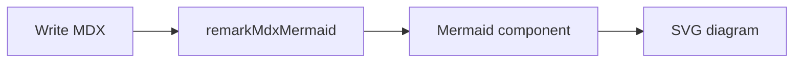

## Admonitions

Callouts cover common guidance states. Use the JSX component or MDX directives (`:::note`, `:::tip`, …).

<Callout type="note" title="Note">
  Neutral context or a short aside.
</Callout>

<Callout type="tip" title="Tip">
  Practical advice that helps readers move faster.
</Callout>

<Callout type="info" title="Info">
  Supporting detail that is good to know.
</Callout>

<Callout type="warning" title="Warning">
  Proceed carefully — something may break.
</Callout>

<Callout type="danger" title="Danger">
  Destructive or irreversible actions.
</Callout>

<Callout type="success" title="Success">
  Confirmation that things worked.
</Callout>

<Callout type="question" title="Question">
  Prompt readers to think or check something.
</Callout>

Directive form (with `remark-directive` + `remarkDirectiveAdmonition`):

```mdx
:::tip[Pro tip]
Prefer typed config in `watanuki.config.ts`.
:::

:::danger
Do not commit secrets.
:::
```

## Accordion

Bouncy grouped accordion — open item splits into its own rounded card. Items API or children API.

```tsx
import { Accordion, Accordions } from '@watanuki/ui/components/accordion'

<Accordion
  items={[
    { id: 'a', title: 'Release Brief', description: '…', icon: <FileText /> },
  ]}
  defaultValue="a"
/>

<Accordions defaultValue="a">
  <Accordion title="Release Brief">Summary content</Accordion>
</Accordions>
```

<AccordionDemo />

## Mermaid

Diagrams from `mermaid` code fences (via `remarkMdxMermaid`) or `<Mermaid chart={...} />`. Theme-aware; renders client-side only.

Live diagram (fence → `<Mermaid />`):



Live diagram (explicit component):

<Mermaid chart={`flowchart TD
  Start --> Docs
  Docs --> Ship`} />

Usage:

```tsx
<Mermaid chart={`flowchart TD
  Start --> Docs
  Docs --> Ship`} />
```

## Tweet card

Glass-style X/Twitter embed card for social proof in docs.

```tsx
import { TweetCard } from '@watanuki/ui/components/tweet-card'

<TweetCard href="https://github.com/ctrlcat0x/Watanuki" />
```

<div className="not-prose my-6 flex justify-center">
  <TweetCard href="https://github.com/ctrlcat0x/Watanuki" />
</div>

## Media

Auto-detects image, GIF, audio, or video from the file extension. Override with `type`.

```tsx
import { Media } from '@watanuki/ui/components/media'

<Media src="/placeholder-800x600.svg" alt="Placeholder" />
<Media src="https://upload.wikimedia.org/wikipedia/commons/d/d3/Newtons_cradle_animation_book_2.gif" />
<Media src="https://interactive-examples.mdn.mozilla.net/media/cc0-audio/t-rex-roar.mp3" />
<Media src="https://interactive-examples.mdn.mozilla.net/media/cc0-videos/flower.mp4" />
<Media src="..." type="video" />
```

### Image

Click to zoom (`react-medium-image-zoom`). Click again or the backdrop to close.

<Media src="/placeholder-800x600.svg" alt="800 × 600 placeholder" />

### GIF

Same zoom behavior as images.

<Media
  src="https://upload.wikimedia.org/wikipedia/commons/d/d3/Newtons_cradle_animation_book_2.gif"
  alt="Newton's cradle animation"
/>

### Audio

Play/pause, waveform seek, speed and volume menus.

<Media src="https://interactive-examples.mdn.mozilla.net/media/cc0-audio/t-rex-roar.mp3" />

### Video

Floating controls, scrub bar, time, speed, volume, fullscreen.

<Media src="https://interactive-examples.mdn.mozilla.net/media/cc0-videos/flower.mp4" />

## YouTube

Embed by video ID or full URL.

```tsx
import { YouTube } from '@watanuki/ui/components/youtube'

<YouTube id="dQw4w9WgXcQ" />
<YouTube src="https://www.youtube.com/watch?v=dQw4w9WgXcQ" />
```

<YouTube id="dQw4w9WgXcQ" className="my-4" />

## Tabs

Sliding indicator on triggers. Panel chrome stays put; **inner content** blur-slides in on change.

Shared selection via `groupId` (sessionStorage). Set `persist` to also write localStorage. Optional `queryString` mirrors the value into the URL (`?package-manager=pnpm`).

Code fences with `tab="npm"` use the same storage when you add `tab-group="package-manager"` (or enable `remarkNpmOptions.persist` for `package-install` / `npm` fences).

```tsx
<Tabs groupId="package-manager" persist items={['npm', 'pnpm', 'yarn', 'bun']}>
  <Tab value="npm">npm install @watanuki/ui</Tab>
  <Tab value="pnpm">pnpm add @watanuki/ui</Tab>
</Tabs>
```

```bash tab="npm" tab-group="package-manager"
npm install @watanuki/ui
```

```bash tab="pnpm" tab-group="package-manager"
pnpm add @watanuki/ui
```

Live synced group (`groupId="package-manager"`):

<Tabs groupId="package-manager" persist items={['npm', 'pnpm', 'yarn', 'bun']}>
  <Tab value="npm">Use npm to install packages.</Tab>
  <Tab value="pnpm">Use pnpm (preferred in this monorepo).</Tab>
  <Tab value="yarn">Use Yarn Classic / Berry.</Tab>
  <Tab value="bun">Use Bun.</Tab>
</Tabs>

```bash tab="npm" tab-group="package-manager"
npm install @watanuki/ui
```

```bash tab="pnpm" tab-group="package-manager"
pnpm add @watanuki/ui
```

```bash tab="yarn" tab-group="package-manager"
yarn add @watanuki/ui
```

```bash tab="bun" tab-group="package-manager"
bun add @watanuki/ui
```

Framework picker (no shared group):

<Tabs items={['Next.js', 'TanStack', 'Waku']}>
  <Tab value="Next.js">App Router docs layout with `@watanuki/ui`.</Tab>
  <Tab value="TanStack">Start + file routes.</Tab>
  <Tab value="Waku">Minimal RSC docs setup.</Tab>
</Tabs>

## Browser frame (Safari)

Safari-style browser chrome for screenshots and product previews.

```tsx
import { Safari } from '@watanuki/ui/components/safari'

<Safari url="watanuki.dev" imageSrc="/placeholder-1200x700.svg" />
```

<Safari url="watanuki.dev" imageSrc="/placeholder-1200x700.svg" className="my-4" />

## Image comparison

Drag (or hover) the divider to compare before/after images.

```tsx
import { ImageCompare } from '@watanuki/ui/components/image-compare'

<ImageCompare
  beforeImage="/placeholder-800x450.svg"
  afterImage="/placeholder-800x450-after.svg"
/>
```

<ImageCompare
  beforeImage="/placeholder-800x450.svg"
  afterImage="/placeholder-800x450-after.svg"
  className="my-4"
/>

## Comparison table

Feature matrix with status cells: `true` / `false` / `'partial'` / `null`.

```tsx
import { ComparisonTable } from '@watanuki/ui/components/comparison-table'

<ComparisonTable
  columns={['Watanuki', 'Fumadocs']}
  rows={[
    { feature: 'Design System', description: '...', values: [true, true] },
    { feature: 'Dark Mode', values: [true, false] },
  ]}
/>
```

<ComparisonTableDemo />

## Hover card (Glimpse)

Underlined link with a preview popover on hover.

```tsx
import { HoverCard } from '@watanuki/ui/components/hover-card'

Check out{' '}
<HoverCard
  href="https://github.com/fuma-nama/fumadocs"
  title="fuma-nama/fumadocs"
  description="The beautiful docs framework for React developers."
  image="/placeholder-1200x700.svg"
>
  Fumadocs
</HoverCard>{' '}
on GitHub.
```

<div className="not-prose my-6 text-center text-lg text-fd-foreground">
  Check out{' '}
  <HoverCard
    href="https://github.com/fuma-nama/fumadocs"
    title="fuma-nama/fumadocs"
    description="The beautiful docs framework for React developers."
    image="/placeholder-1200x700.svg"
  >
    Fumadocs
  </HoverCard>{' '}
  on GitHub.
</div>

## Terminal

Animated terminal with typewriter command, staggered output, and a sliding tab capsule. Uses theme tokens by default; pass `alwaysDark` to force dark chrome.

```tsx
import { Terminal, defaultTerminalTabs } from '@watanuki/ui/components/terminal'

<Terminal tabs={defaultTerminalTabs} defaultActiveTab={1} />
```

<Terminal defaultActiveTab={1} className="my-4" />

## Code blocks

Fenced blocks use Shiki with Watanuki defaults. Two shell variants:

- **No header** — floating copy button (hover / focus)
- **Header** — `title="..."` bar with copy on the right

### No header

```ts
export const provider = 'orama';
```

### Header / filename

```ts title="lib/search.ts"
export const provider = 'orama';
```

### Line numbers

Add `lineNumbers` (or `lineNumbers=5` to start at 5).

```ts title="line-numbers.ts" lineNumbers
export function greet(name: string) {
  return `Hello, ${name}`;
}
```

### Meta highlight

Highlight lines with `{1,3-4}` in the fence meta.

```ts {2,4} title="meta-highlight.ts"
const a = 1;
const b = 2;
const c = 3;
const d = 4;
```

### Notation focus

```ts title="focus.ts"
export function SearchTrigger() {
  // [!code focus:3]
  return (
    <button className="rounded-lg border px-3 py-2">
      Search docs
    </button>
  );
}
```

### Word highlight

```ts title="word-highlight.ts"
// [!code word:provider]
const provider = 'orama';
```

### Diff notation

```ts title="diff.ts"
export const provider = 'local'; // [!code --]
export const provider = 'algolia'; // [!code ++]
```

## Code groups

Use fenced blocks with `tab="..."` meta to create grouped examples.

```ts tab="TypeScript"
const style = 'minimal';
```

```js tab="JavaScript"
const style = 'minimal';
```

## Code block primitive

Use `<CodeBlock />` when content comes from props or when you want explicit tab data in MDX.

<CodeBlock
  tabs={[
    { label: 'npm', code: 'npm install @watanuki/ui' },
    { label: 'pnpm', code: 'pnpm add @watanuki/ui' },
    { label: 'yarn', code: 'yarn add @watanuki/ui' },
    { label: 'bun', code: 'bun add @watanuki/ui' },
  ]}
/>

## Steps (vertical)

Vertical content steps for docs (also used by `remark-steps`). Distinct from the horizontal stepper below.

<Steps>
  <Step>
    ### Install packages

    Add `@watanuki/ui` and peers to your app.
  </Step>
  <Step>
    ### Write MDX

    Drop pages under `content/docs`.
  </Step>
</Steps>

## Stepper (horizontal)

Interactive progress UI — numbered indicators, connectors, clickable steps, optional prev/next.

```tsx
<Stepper defaultValue={0}>
  <StepperItem title="Install" description="Add packages" />
  <StepperItem title="Configure" description="Set watanuki.config" />
  <StepperItem title="Write" description="Add MDX pages" />
</Stepper>
```

<Stepper defaultValue={0}>
  <StepperItem title="Install" description="Add packages">
    Run `pnpm add @watanuki/ui` (and peers) in your docs app.
  </StepperItem>
  <StepperItem title="Configure" description="Set watanuki.config">
    Define layout style and search provider in `lib/watanuki.config.ts`.
  </StepperItem>
  <StepperItem title="Write" description="Add MDX pages">
    Create pages under `content/docs` and register MDX components.
  </StepperItem>
</Stepper>

Import from `@watanuki/ui/components/stepper` or use via `@watanuki/ui/mdx`.

## File tree

Use the tree primitives for project structure, CLI output, or generated `<auto-files />` sections.

<Files>
  <Folder name="app" defaultOpen>
    <File name="layout.tsx" />
    <Folder name="docs" defaultOpen>
      <File name="page.mdx" />
      <File name="components.mdx" />
    </Folder>
  </Folder>
  <Folder name="content" defaultOpen>
    <File name="index.mdx" />
    <File name="getting-started.mdx" />
  </Folder>
</Files>

## GitHub info

Fetch and display a repository card from the GitHub API. Any public `owner`/`repo` works.

```tsx
<GithubInfo owner="ctrlcat0x" repo="watanuki" />
```

Live demo uses a public fallback while that repository is private:

<GithubInfo owner="fuma-nama" repo="fumadocs" />

## Type table

Use `TypeTable` for API contracts, config references, and prop documentation.

<TypeTable
  type={{
    name: {
      type: 'string',
      description: 'Visible field label.',
      required: true,
    },
    defaultOpen: {
      type: 'boolean',
      description: 'Opens the branch on first render.',
      default: 'false',
    },
    icon: {
      type: 'ReactNode',
      description: 'Optional icon override for file items.',
    },
  }}
/>

### AutoTypeTable

Generate the same table from a TypeScript export via `@watanuki/typescript`.

Wire once in MDX components:

```tsx
import { createGenerator } from '@watanuki/typescript'
import { AutoTypeTable } from '@watanuki/typescript/ui'

const generator = createGenerator()

AutoTypeTable: (props) => <AutoTypeTable {...props} generator={generator} />
```

Then in MDX:

```mdx
<AutoTypeTable path="./lib/sample-types.ts" name="SampleButtonProps" />
```

<AutoTypeTable path="./lib/sample-types.ts" name="SampleButtonProps" />

Inline type (no file):

<AutoTypeTable
  name="InlineProps"
  type={`
export interface InlineProps {
  /** Site title shown in the navbar */
  title: string
  /** Optional subtitle */
  description?: string
}
`}
/>

## Timeline

Changelog / release history. Vertical line, dates on the left, version pills, markdown content on the right.

```tsx
<Timeline>
  <TimelineItem date="Dec 15, 2025" version="1.0.27">
    <h3>Icons</h3>
    <ul>
      <li>Added <code>SidebarIcon</code> variants</li>
    </ul>
  </TimelineItem>
</Timeline>
```

<Timeline>
  <TimelineItem date="Dec 15, 2025" version="1.0.27">
    <h3>Icons</h3>
    <ul>
      <li>
        Added <code>SidebarIcon</code> variants for collapsed layouts
      </li>
      <li>
        Fixed dark-mode contrast on <code>fd-muted-foreground</code>
      </li>
    </ul>
  </TimelineItem>
  <TimelineItem date="Nov 2, 2025" version="1.0.20">
    <h3>Search</h3>
    <ul>
      <li>Orama static index export</li>
      <li>
        Keyboard shortcut <code>⌘K</code> / <code>Ctrl+K</code>
      </li>
    </ul>
  </TimelineItem>
  <TimelineItem date="Sep 18, 2025" version="1.0.0">
    <h3>Initial release</h3>
    <ul>
      <li>
        Docs layouts, MDX primitives, and <code>create-watanuki</code>
      </li>
    </ul>
  </TimelineItem>
</Timeline>

## Math (KaTeX)

Opt-in. Enable in `source.config.ts` and import KaTeX CSS.

Use `$…$` / `$$…$$` — not a `math` code fence (Shiki has no `math` language):

```ts
export default defineConfig({
  mdxOptions: {
    remarkMathOptions: {},
    rehypeKatexOptions: {},
  },
})
```

```css
@import 'katex/dist/katex.min.css';
```

Inline: $E = mc^2$

Block:

$$
\int_{-\infty}^{\infty} e^{-x^2} dx = \sqrt{\pi}
$$
