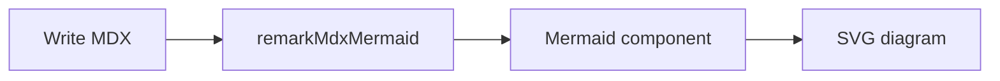

Mermaid turns text-based definitions into diagrams that live beside the source documentation. Because the diagram is written as code, it is easier to review, update, and keep synchronized with changing architecture or workflows.

## When to use it

- Request flows, state transitions, and multi-step processes
- System architecture and service relationships
- Decision trees where branches are harder to explain linearly

## Why it helps

Use a diagram when relationships matter more than individual facts. Keep labels short and the graph focused; if the diagram needs a long legend, split it into smaller diagrams or support it with prose.

## Example

Diagrams from `mermaid` code fences (via `remarkMdxMermaid`) or `<Mermaid chart={...} />`. Theme-aware; renders client-side only.

Live diagram (fence → `<Mermaid />`):



Live diagram (explicit component):

<Mermaid chart={`flowchart TD
  Start --> Docs
  Docs --> Ship`} />

Usage:

```tsx
<Mermaid chart={`flowchart TD
  Start --> Docs
  Docs --> Ship`} />
```
